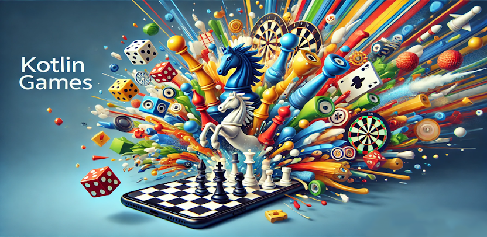
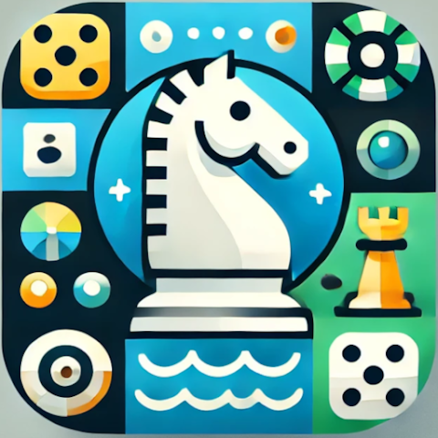
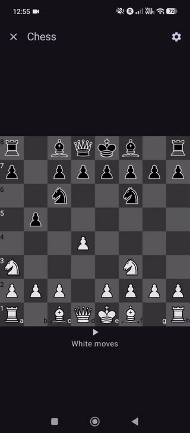
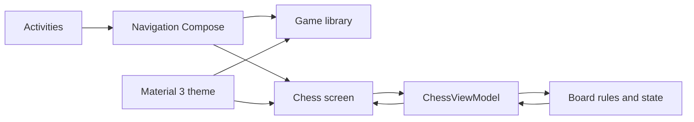
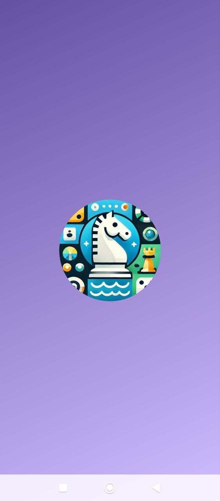
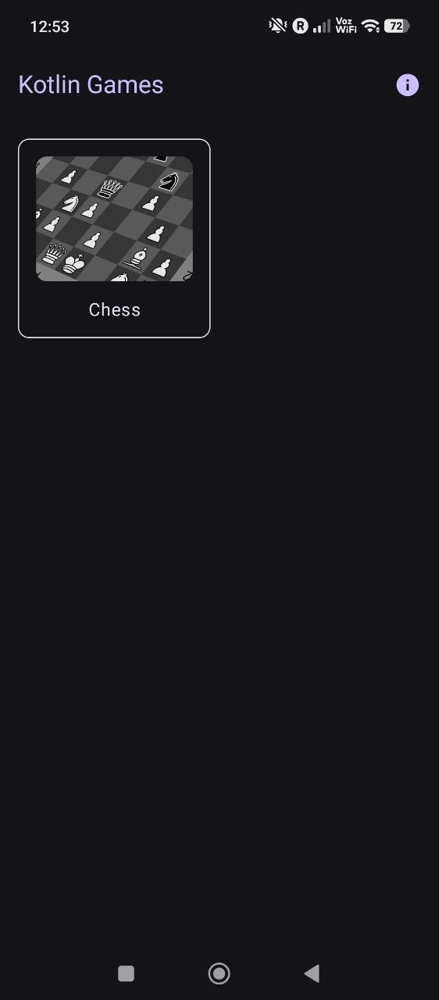
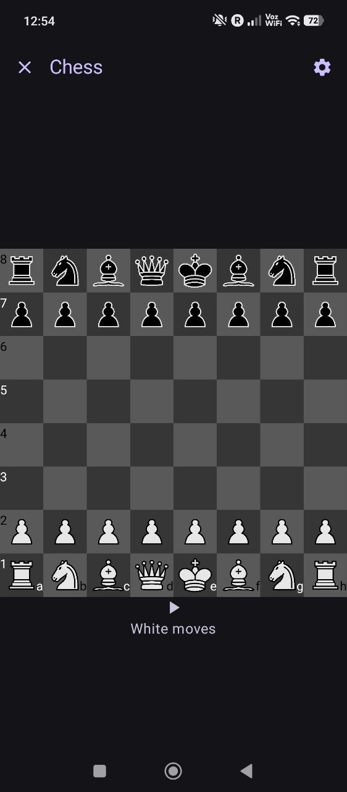
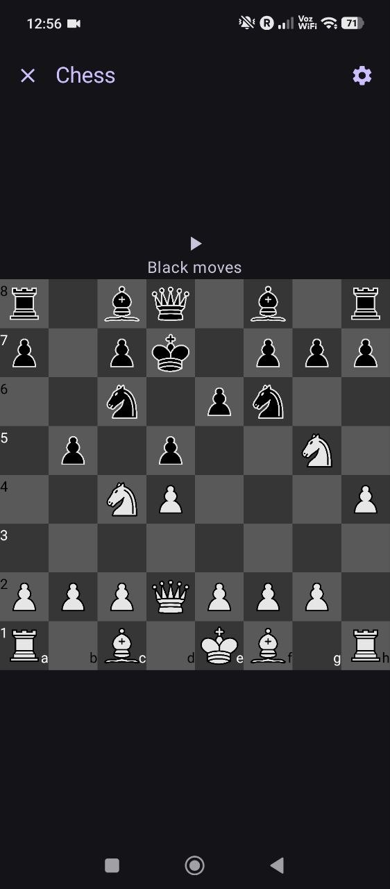

<p align="center">
  
</p>

<p align="center">
  
</p>

<h1 align="center">Kotlin Games</h1>

<p align="center">
  A native Android collection of classic board games, built from the ground up with Kotlin and Jetpack Compose.
</p>

<p align="center">
  <a href="https://kotlinlang.org/"></a>
  <a href="https://developer.android.com/compose"></a>
  
  <a href="https://github.com/mduranx64/kotlin-games/actions/workflows/android.yml"></a>
  <a href="LICENSE"></a>
</p>

<p align="center">
  <a href="https://play.google.com/store/apps/details?id=com.mduranx64.kotlingames&hl=en">
    
  </a>
</p>

## About the project

Kotlin Games is an open-source Android app that turns classic tabletop games into polished native mobile experiences. The first available game is local two-player Chess, backed by a custom rules engine and a responsive Compose interface that works in portrait and landscape orientations.

The project is also a practical showcase of modern Android development: declarative UI, lifecycle-aware state, accessible interactions, adaptive layouts, custom domain logic, and automated Play Store delivery. The app runs entirely on-device and does not collect user data.

## Gameplay

<p align="center">
  
</p>

## Engineering highlights

- **Compose-first UI** — Material 3 components, reusable composables, previews, light/dark themes, and edge-to-edge system-bar handling.
- **Adaptive game board** — dedicated portrait and landscape arrangements sized from the available screen dimensions.
- **Custom chess engine** — turn tracking, piece-specific move validation, captures, castling, en passant, and pawn promotion implemented in Kotlin.
- **Observable state** — a lifecycle-aware `ViewModel` exposes Compose state so board updates immediately drive the interface.
- **Accessible interaction** — semantic descriptions identify pieces, colors, board coordinates, and empty squares for assistive technology.
- **Production delivery** — Gradle release builds, Fastlane lanes, signed artifacts, and GitHub Actions deployment to Google Play.

## Architecture

The UI observes a single game state and sends board selections back to the domain layer. Navigation and Android lifecycle concerns remain outside the chess rules engine.



## Built with

| Area | Technology |
| --- | --- |
| Language | Kotlin 1.9 |
| UI | Jetpack Compose, Material 3 |
| State | AndroidX Lifecycle ViewModel, Compose state |
| Navigation | Navigation Compose |
| Build | Gradle Kotlin DSL, version catalogs |
| Delivery | GitHub Actions, Fastlane, Google Play |
| Compatibility | Android 9 (API 28) and newer |

## Screenshots

<p align="center">
  
  
  
  
</p>

## Run locally

### Requirements

- Android Studio with Android SDK 35
- JDK 17
- An emulator or physical device running Android 9 or newer

### Build

```bash
git clone https://github.com/mduranx64/kotlin-games.git
cd kotlin-games/KotlinGames
./gradlew assembleDebug
```

Open the `KotlinGames` directory in Android Studio to run and debug the app interactively. Release builds require the signing environment variables configured by the CI workflow; they are not needed for local debug builds.

## Roadmap

- Add more classic board games to the library
- Expand chess end-state handling with check, checkmate, and stalemate detection
- Grow unit and Compose UI coverage around the game engine and user flows

## Credits

Chess artwork is based on assets from [OpenGameArt](https://opengameart.org/content/chess-pieces-and-board-squares).

## License

Kotlin Games is available under the [MIT License](LICENSE).

---

<p align="center">
  Built by <a href="https://github.com/mduranx64">Miguel Duran</a> — explore the code, try the app, or get in touch on GitHub.
</p>
